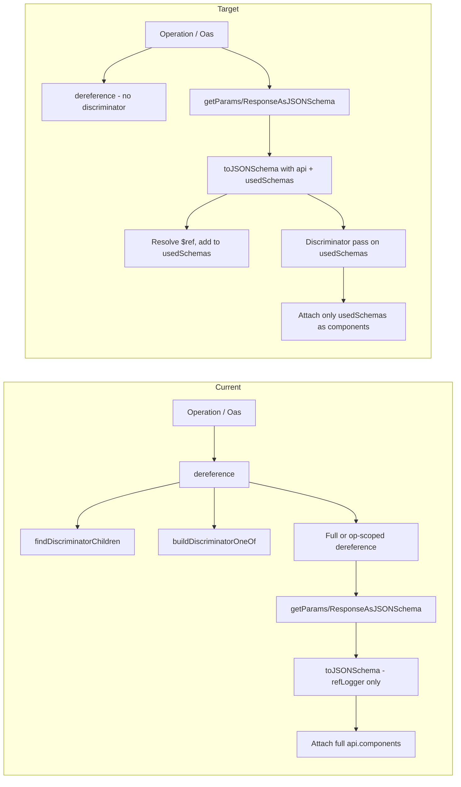

# Move discriminator and $ref handling into getParametersAsJSONSchema / getResponseAsJSONSchema

## Current behavior

- **Oas.dereference()** ([packages/oas/src/index.ts](packages/oas/src/index.ts)) and **Operation.dereference()** ([packages/oas/src/operation/index.ts](packages/oas/src/operation/index.ts)) call `findDiscriminatorChildren(api)`, then run the parser with an `excludedPathMatcher` so only discriminator-related component schemas are dereferenced, then call `buildDiscriminatorOneOf()` on the result. This causes full-doc (or operation-scoped) dereferencing and memory bloat.
- **getParametersAsJSONSchema** and **getResponseAsJSONSchema** are intended to be used after `dereference()`. They throw if `isDereferenced()` (documentation says they are “not compatible” with dereferenced definitions for the `shouldFollowRefs` option). They pass operation/api and schemas into `toJSONSchema()` in [packages/oas/src/lib/openapi-to-json-schema.ts](packages/oas/src/lib/openapi-to-json-schema.ts). When `toJSONSchema` sees a `$ref` it only calls `refLogger` and returns the ref as-is (assumes dereferenced or circular). When circular/discriminator refs are logged, the methods attach **all** of `api.components` (params: transformed to JSON Schema; response: raw clone) to the output, causing bloat.

## Target behavior

1. **dereference()** no longer does any discriminator work: no `findDiscriminatorChildren`, no `buildDiscriminatorOneOf`, and no discriminator-specific `excludedPathMatcher` logic. Plain dereference only.
2. **getParametersAsJSONSchema** and **getResponseAsJSONSchema** no longer require or use `dereference()`. They work on the original (non-dereferenced) operation and api.
3. These two methods perform **local $ref resolution** during JSON Schema generation: resolve refs on the fly (e.g. via existing `dereferenceRef`), and **accumulate only the schemas actually used** in a map. Output JSON Schema uses `$ref` (e.g. `#/components/schemas/Name`) and attaches a **components** object containing only those used schemas (no full `api.components`).
4. **Discriminator handling** (building `oneOf` for discriminator bases, stripping nested discriminator/oneOf in children) is done **inside** these two methods (or in shared code they call), so generated schemas remain equivalent for discriminators.
5. Call sites and tests that currently call `dereference()` before these two methods are updated to stop calling `dereference()`; expectations are updated so generated schemas match or stay as close as possible (e.g. root may use `$ref` + `components.schemas` instead of inlined content).

---

## 1. Remove discriminator logic from dereference

**Oas.dereference()** ([packages/oas/src/index.ts](packages/oas/src/index.ts), ~836–934):

- Remove the call to `findDiscriminatorChildren(this.api)` and the variable `discriminatorChildrenMap`.
- Remove the call to `buildDiscriminatorOneOf(this.api, discriminatorChildrenMap)` after `dereference()` resolves.
- Keep the rest of the flow (e.g. `x-readme-ref-name` / optional `title` preservation, circular ref tracking, `dereference()` from `@readme/openapi-parser`).

**Operation.dereference()** ([packages/oas/src/operation/index.ts](packages/oas/src/operation/index.ts), ~1115–1302):

- Remove the call to `findDiscriminatorChildren(this.api)` and both `discriminatorChildrenMap` and `discriminatorChildrenMapInverted`.
- Simplify `excludedPathMatcher`: remove the block that allows discriminator-related component schemas to be dereferenced; exclude all of `#/components` (or keep a single rule that excludes paths under `#/components` so only the operation’s `__INTERNAL__` and its refs are dereferenced, without special-casing discriminators).
- Remove the call to `buildDiscriminatorOneOf({ components: dereferenced.components }, discriminatorChildrenMap)` after parsing.
- Keep the rest (e.g. `x-readme-ref-name` on component schemas, circular ref handling, `$RefParser` usage).

---

## 2. Ref-resolution and used-schemas in openapi-to-json-schema

**Extend [packages/oas/src/lib/openapi-to-json-schema.ts](packages/oas/src/lib/openapi-to-json-schema.ts)** so that when generating JSON Schema for the two methods, refs are resolved and only used schemas are accumulated.

- Add optional parameters to the conversion (e.g. on `toJSONSchema` or a wrapper used only by the two methods):
  - `api: OASDocument` (or a resolve callback).
  - `usedSchemas: Map<string, SchemaObject>` (or equivalent) to accumulate only schemas that are referenced.
  - Optional `refPrefix` (e.g. `'#/components/schemas/'`) for the emitted `$ref` values.
- When the current schema is a **single `$ref`** (e.g. at root or in oneOf/anyOf/items/properties):
  - Resolve with `dereferenceRef(schema, api, seenRefs)` (reuse existing ref + circular handling).
  - Derive a stable key (e.g. schema name from `#/components/schemas/Name`).
  - If the key is already in `usedSchemas` (and not a placeholder), return `{ $ref: refPrefix + key }`.
  - If not: put a placeholder in `usedSchemas` for that key (to handle circular refs), recursively convert the resolved schema (with the same `api`, `usedSchemas`, `refPrefix`), then set `usedSchemas[key] = convertedSchema` and return `{ $ref: refPrefix + key }`.
- When processing **allOf**: resolve any allOf entry that is a `$ref`, convert it, add to `usedSchemas`, and use the converted schema (or a ref to it) for merging; keep existing merge behavior so the merged result is equivalent.
- Ensure **circular refs** only produce a `$ref` and a single entry in `usedSchemas` (no infinite recursion).

This keeps the rest of `toJSONSchema` behavior (nullable, discriminator property handling, enum merging, etc.) unchanged except for the ref-resolution and used-schemas bookkeeping when `api` and `usedSchemas` are provided.

---

## 3. Discriminator handling inside the two methods

- **Shared discriminator pass** (can live in [packages/oas/src/lib/build-discriminator-one-of.ts](packages/oas/src/lib/build-discriminator-one-of.ts) or in the transformers): given `api` and a **map** of used schemas (name → JSON Schema object):
  - Call `findDiscriminatorChildren(api)`.
  - For each discriminator base that appears in the used-schemas map, ensure its children are in the map (resolve and convert each child from `api`, add to map if missing), then set the base’s `oneOf` to an array of `{ $ref: refPrefix + childName }` for each child.
  - Optionally apply the same “strip oneOf/discriminator from embedded base in child allOf” logic that `buildDiscriminatorOneOf` does, so that nested discriminator UIs are not duplicated (apply to the used-schemas map entries).
- **getParametersAsJSONSchema** and **getResponseAsJSONSchema**:
  - Invoke the conversion with `api` and a new `usedSchemas` map and `refPrefix = '#/components/schemas/'`.
  - After the initial conversion (root + all refs it pulls in), run the discriminator pass on `usedSchemas` so discriminator bases get `oneOf` and children are present.
  - Attach **only** `usedSchemas` as the output’s components (e.g. `schema.components = { schemas: Object.fromEntries(usedSchemas) }` or the structure already used today). Do not attach the full `api.components`.

---

## 4. getParametersAsJSONSchema changes

**File:** [packages/oas/src/operation/transformers/get-parameters-as-json-schema.ts](packages/oas/src/operation/transformers/get-parameters-as-json-schema.ts).

- Remove the `isDereferenced()` check that throws (so the method can be used without calling `dereference()`).
- Introduce a `usedSchemas` map and pass it (with `api` and `refPrefix`) into every `toJSONSchema` call used for this method (request body schema, parameter schemas, and when building components). Ensure request body and parameters that contain `$ref` are resolved and recorded in `usedSchemas`.
- Replace **transformComponents()** (which currently converts every component) with: after conversion, run the discriminator pass on `usedSchemas`, then set each group’s `schema.components` to the **used schemas only** (e.g. `{ schemas: Object.fromEntries(usedSchemas) }`). Only attach components when there are used refs (or when discriminator mapping refs are included and present), so behavior stays consistent with “include components when we have circular or discriminator refs.”
- Keep existing options (e.g. `includeDiscriminatorMappingRefs`) and the same high-level output shape (array of groups with `schema`, etc.); only the contents of `schema.components` and the presence of `$ref` in the main schema change.

---

## 5. getResponseAsJSONSchema changes

**File:** [packages/oas/src/operation/transformers/get-response-as-json-schema.ts](packages/oas/src/operation/transformers/get-response-as-json-schema.ts).

- Remove the `isDereferenced()` check that throws.
- Introduce a `usedSchemas` map and pass it (with `api` and `refPrefix`) into the `toJSONSchema` call(s) used for the response body schema.
- After conversion, run the same discriminator pass on `usedSchemas`.
- Instead of attaching `cloneObject(api.components)` when `hasCircularRefs || hasDiscriminatorMappingRefs`, attach **only** the collected `usedSchemas` (e.g. `schema.components = { schemas: Object.fromEntries(usedSchemas) }`). Refs in the response schema should use `#/components/schemas/Name` so they resolve against this components object.
- Ensure headers and other branches that use `toJSONSchema` also participate in `usedSchemas` if they can contain refs.

---

## 6. Operation index: allow calling without dereference

**File:** [packages/oas/src/operation/index.ts](packages/oas/src/operation/index.ts).

- In `getParametersAsJSONSchema` and `getResponseAsJSONSchema`, remove the `if (this.isDereferenced()) { throw ... }` block (or relax it if you still want to forbid use after dereference for another reason). The goal is that callers do **not** need to call `dereference()` before these methods and the methods work correctly on non-dereferenced definitions.

---

## 7. Tests and call sites

- **Tests that call `dereference()` before getParametersAsJSONSchema or getResponseAsJSONSchema**
  Remove the `await operation.dereference()` / `await spec.dereference()` calls in those tests so the methods run on non-dereferenced definitions.
- **Snapshot and expectation updates**
  - Where the current expected output is a fully inlined schema (no `$ref`), update expectations to allow a root or nested `$ref` to `#/components/schemas/...` and a `components.schemas` object containing only the used schemas.
  - Discriminator tests should still expect discriminator bases to have `oneOf` and the correct children; the new discriminator pass in the two methods should preserve that.
  - Preserve or adjust any assertions on `components` so they assert on the **reduced** components (only used schemas) rather than the full api components.
- **Other uses of dereference()**
  Leave unchanged: e.g. getResponseExamples, getRequestBodyExamples, getCallbackExamples, getCircularReferences, analyzer, reducer, and index/operation tests that only assert on `dereference()` itself. They still need `dereference()` for their behavior.

---

## 8. Summary diagram

---

## Risks and validation

- **Schema equivalence**: The most critical part is that the generated JSON Schema (structure, required fields, types, discriminators, oneOf) remains valid and as close as possible to the current behavior. Focus testing on discriminator-heavy specs (e.g. discriminator-allof-inheritance, ably, embeded-discriminator) and on specs with circular refs.
- **Ref stability**: Use a consistent key (e.g. last segment of `#/components/schemas/Name`) so that `$ref` and `components.schemas` keys match.
- **Circular refs**: Reuse the same “seen refs” / placeholder approach so circular refs produce a single `$ref` and one component entry, and do not recurse indefinitely.
- **Backward compatibility**: Other consumers of `Oas.dereference()` and `Operation.dereference()` (examples, callbacks, circular ref reporting, analyzer) are unchanged; only the discriminator post-processing is removed from `dereference()`, and the two JSON Schema methods no longer rely on it.
